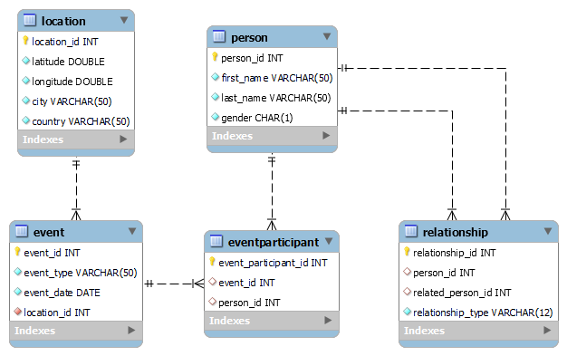

# Natural Language SQL Project

### Database Description
This is a database designed to be similar to the database used for the old CS 240 project Family Map, but souped up a little bit (with the help of ChatGPT).
It has People and Events, but also a separate location table and tables for event participation (so multiple people could participate in events) and relationships between people.

I also asked ChatGPT to load the passoff data in these tables, which it did an pretty ok job with, although I did have to correct a few errors it made.

### DB Schema


## Results

### Qustion that worked well
I was impressed by the level ChatGPT was able to connect the data.
I asked the question `Which 3 events occurred farthest south, and who particpated in them?`
which generated the SQL
```sql
SELECT e.event_id, e.event_type, e.event_date, l.latitude, p.first_name, p.last_name
FROM Event e
JOIN Location l ON e.location_id = l.location_id
JOIN EventParticipant ep ON e.event_id = ep.event_id
JOIN Person p ON ep.person_id = p.person_id
ORDER BY l.latitude ASC
LIMIT 3;
```
which was interpreted by ChatGPT as
```
The 3 events that occurred farthest south are:

1. Event ID 1: "birth" on 1970-05-12 at latitude -36.1833, participated by Sheila Parker.
2. Event ID 16: "Learned to Surf" on 2000-09-23 at latitude -27.9833, participated by Mrs. Jones.
3. Event ID 15: "Ate Brazilian Barbecue" on 2012-01-09 at latitude -24.5833, participated by Mrs. Jones.
```

I was really impressed by it's ability to infer what "farthest south" meant and join that many tables together correctly, although it did give a bit more data than I was hoping for.

### Question that didn't work as well

I asked `Which person has the most ancestors in the database, and how many ancesters did they have? Please include as many direct ancestors as possible, including grandparents, great-grandparents, and so on.` GPT gave the SQL
```sql
WITH RECURSIVE Ancestors AS (
    SELECT p.person_id, r.related_person_id
    FROM Person p
    JOIN Relationship r ON p.person_id = r.person_id
    WHERE r.relationship_type = 'Parent'

    UNION ALL

    SELECT p.person_id, r.related_person_id
    FROM Person p
    JOIN Relationship r ON p.person_id = r.person_id
    JOIN Ancestors a ON a.related_person_id = r.person_id
)

SELECT a.person_id, COUNT(DISTINCT a.related_person_id) AS ancestor_count
FROM Ancestors a
GROUP BY a.person_id
ORDER BY ancestor_count DESC
LIMIT 1;
```
which was really impressive but ultimately incorrect. The analysis of the output is `Person with ID 3 has the most ancestors in the database, with a total of 3 ancestors.` The maximum number of ancestors for anyone is actually 6. I ran this question multiple times, and it did manage to get the correct answer on 1 of 4 or 5 tries.

To be fair to ChatGPT, I don't think I could write a single sql query to solve this problem either.

### Data
You can see the rest of the data [here](output.json) 

### Prompting strategies
ChatGPT did really well on this dataset (except for the recursive ancestors question) even on the zero-shot with only the schema that I didn't try any of the more complicated strategies. I don't think it would have done any better on the one problem it did mess up even if I gave it more data.

### Other takeaways
I was surprised how disparate the amount of things GPT queried for was sometimes. In some queries, GPT would ask for things I didn't ask it for. In others, I thought I had implied (or at least it would be common sense, but I guess ChatGPT lacks some of that currently) some query output that it didn't give. It was interesting to see the disparity there.